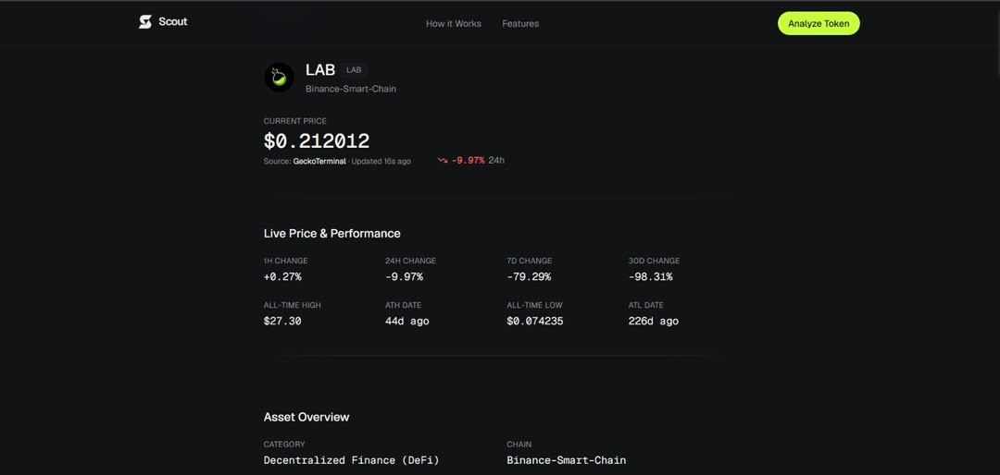
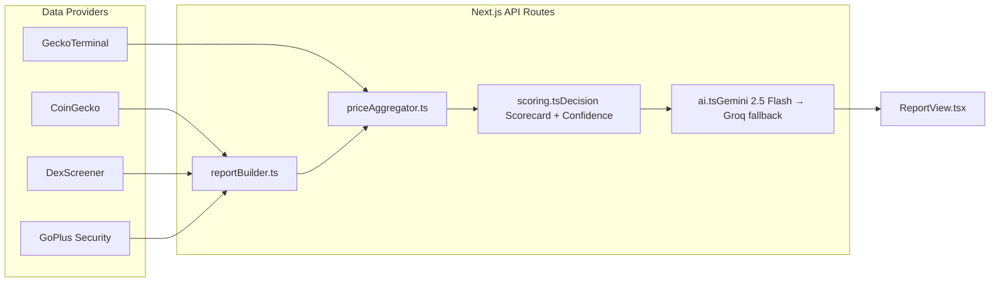

# Scout

An AI agent research analyst for any token, in under 30 seconds.

  

**Scout is analysis with receipts.** Not a trading bot. Not a chatbot. One question, one report:

| | What | Where |
|---|---|---|
| **You ask** | A ticker, a name, a contract address, or plain English — "Should I buy HYPE?" | The search box on the landing page |
| **Scout answers** | A full research report: live price, tokenomics, security, a Decision Scorecard, and a unique investment thesis | `/analyze?q=...` |

The flow: you search a token, Scout fetches price, liquidity, security, and tokenomics data from four independent providers in parallel, resolves the single freshest price across them, computes a deterministic health score and confidence score from what it actually retrieved, and only then hands the complete dataset to Gemini — which returns a unique, evidence-grounded investment thesis for that specific token.

**The one rule: never fabricate a metric.** Every number on the page traces back to a real API response. No verified data for a section means an honest "temporarily unavailable" or "Not Available," not an invented figure. That rule is enforced in `lib/reportBuilder.ts` and covered by the graceful-degradation path on every external call.



## Architecture



The AI is only ever handed data that's already been fetched, merged, and scored — it explains the numbers, it never invents or recalculates them.

## Tech stack

| Layer | Technology |
|---|---|
| Frontend | Next.js 15 (App Router), React 18, TypeScript (strict), Tailwind CSS, Framer Motion, Lucide icons |
| State / data fetching | TanStack Query, Zustand |
| AI | Gemini 2.5 Flash (primary), Groq Llama 3.3 70B (automatic fallback) |
| Market & on-chain data | CoinGecko, DexScreener, GeckoTerminal, GoPlus Security |
| Deployment | Vercel-ready, server-side Next.js API routes keep all keys secret |

## Quick start

Requires Node.js 20 or newer.

```bash
git clone 
cd scout
npm install
cp .env.example .env.local
npm run dev
```

Open [http://localhost:3000](http://localhost:3000).

## Environment variables

| Variable | Required by | Purpose |
|---|---|---|
| `GEMINI_API_KEY` | AI report generation | Primary LLM — get at [Google AI Studio](https://aistudio.google.com/apikey) |
| `GROQ_API_KEY` | AI report generation | Automatic fallback if Gemini is unavailable — get at [console.groq.com](https://console.groq.com/keys) |
| `COINGECKO_API_KEY` | Market data | Optional, raises free-tier rate limits |
| `GOPLUS_API_KEY` | Contract security scanning |

Without `GEMINI_API_KEY` and `GROQ_API_KEY`, Scout still shows all live market/security/tokenomics data — only the AI-written sections (Investment Thesis, Analyst's Verdict, Key Risks) fall back to an honest "temporarily unavailable" message instead of crashing.

## Scripts

| Script | What it does |
|---|---|
| `npm run dev` | Frontend dev server |
| `npm run build` | Production build |
| `npm start` | Serve the production build |
| `npm run lint` | ESLint |

## Verification

Before shipping any change, run:

```bash
npx tsc --noEmit
npm run build
```

Both are run against every change in this repo before it's handed off — there's no CI workflow wired up yet, so this is a manual step for now.

## Repository layout
app/                    Next.js App Router pages and API routes
page.tsx              Landing page (hero, how-it-works, features)
analyze/page.tsx      Single-token report page
compare/page.tsx      Side-by-side comparison page
api/
analyze/route.ts    Aggregates all data sources + AI report for one token
compare/route.ts    Same, for 2-4 tokens + AI comparison conclusion
chat/route.ts        Follow-up Q&A grounded in the generated report
price/route.ts       Lightweight polling endpoint for the live price ticker
search/route.ts      Live search suggestions + natural-language intent detection
ticker/route.ts       Live rotating price ticker on the landing page
components/            UI building blocks (Navbar, Hero, ReportView, Scorecard, ...)
lib/
coingecko.ts, dexscreener.ts, geckoterminal.ts, goplus.ts, ticker.ts
priceAggregator.ts     Multi-source price resolution (freshest reading wins)
scoring.ts             Deterministic Decision Scorecard + confidence score
ai.ts                  Gemini/Groq calls, prompt engineering, JSON recovery
reportBuilder.ts        Orchestrates every source into one TokenReport
store/useScoutStore.ts   Zustand store (recent searches, per-token chat history)
public/                  Logo, OG image, static assets

## Deployment

Ready for Vercel: `vercel deploy`, then set the environment variables from `.env.example` in the Vercel project settings.